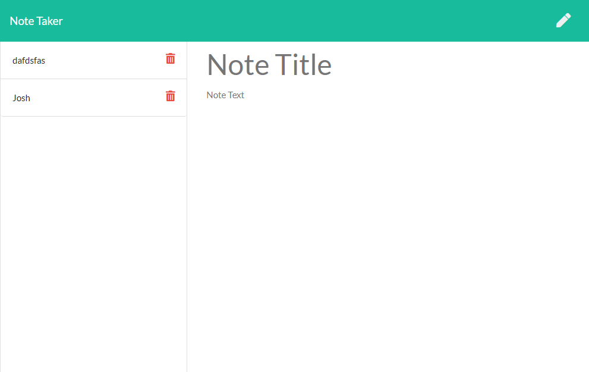

# Note Taker
This website is designed for users to keep track of notes.  Whether you need to keep notes for your full stack web development course or for you job, this website allows you to store notes for reference at a later time.  

## Motivation
My motivation for this website was to create a website to keep track of notes.  As someone who works full time and is taking a full stack web development boot camp, I know how hard it is to keep up with things.  With this website, I've created a way to keep notes to keep myself on track. 

### Image of my website

 

### Website Address

Visit my [Website](https://desolate-island-03681.herokuapp.com/)

### Repository

View my [GitHub_Repository](https://github.com/joshwalters34/note-taker)

### Technologies 
- Express 
- Javascript
- NPM Short Unique ID
- Heroku

### Installation
To install dependencies for this application, run the following commands

        npm init -y
        npm i